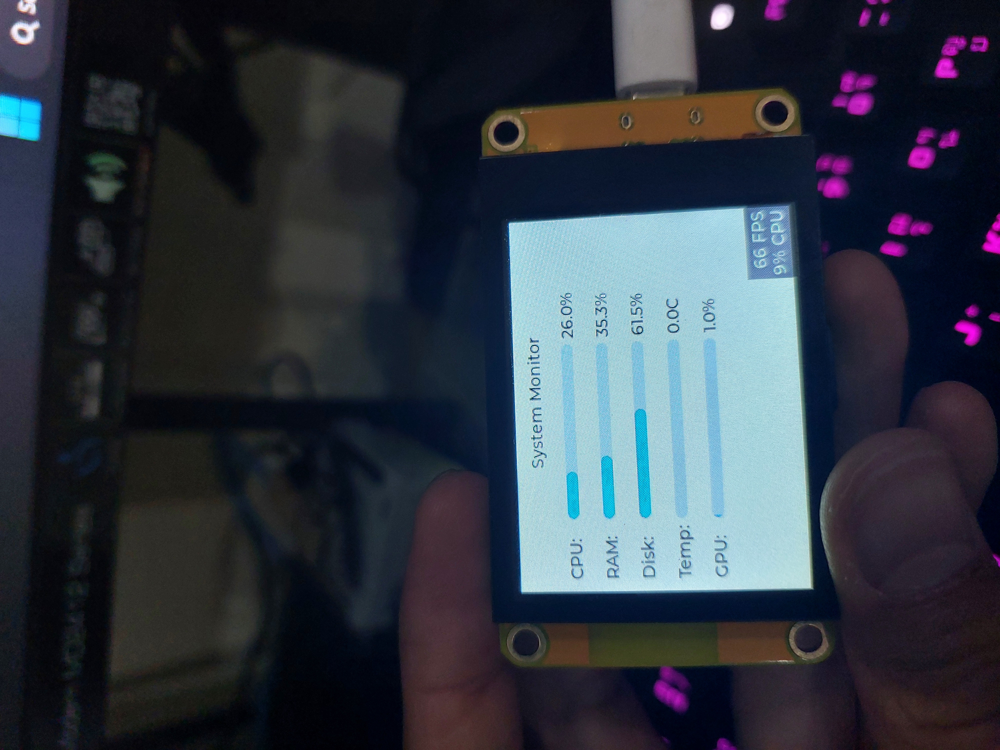
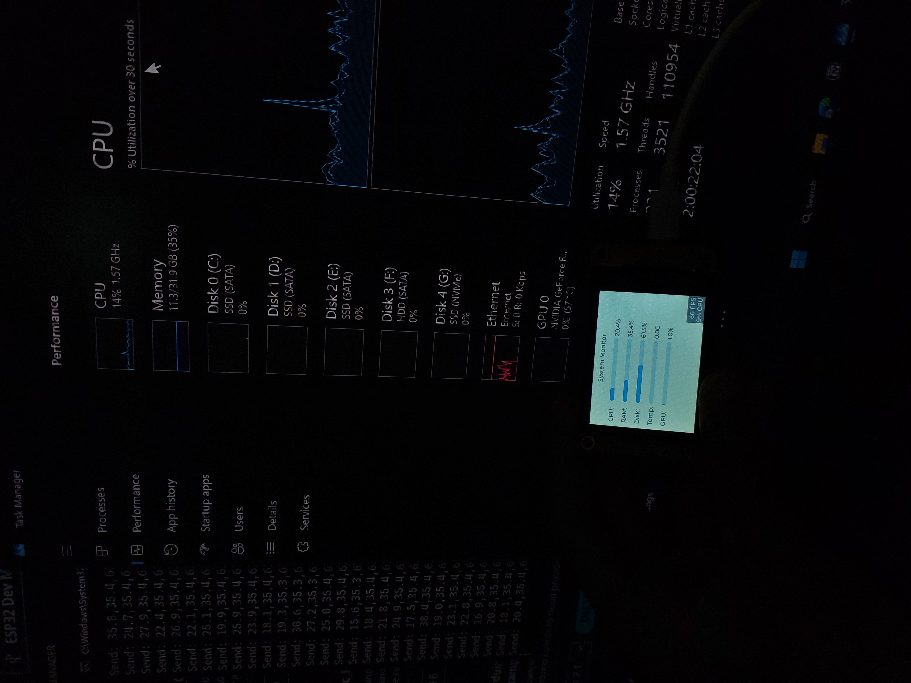

# ESP32 System Monitor Dashboard (with LVGL + ST7789)

📟 This project displays real-time **CPU, RAM, Disk, Temperature, and GPU usage** from your PC to an ESP32 device with a 2.2-inch ST7789 display using **LVGL** and **LovyanGFX**.

<div align="center">
  
</div>
---
<div align="center">
  
    
    
</div>

---

## 🔧 Features

- 📈 Live monitor of:
    - CPU usage
    - RAM usage
    - Disk usage
    - CPU Temperature
    - GPU Usage (via GPUtil)
- 🖥️ Touch support (with CST820)
- 🔁 Screen auto-rotation & touch remapping
- 📊 Beautiful LVGL bar widgets with percent labels
- 📤 Serial communication from PC to ESP32

---

## 📦 Files

| File | Description |
| --- | --- |
| `Factory_samples.ino` | Main Arduino project for ESP32-2432S022 |
| `pc_send.py` | Python script to send system stats via USB Serial |
| `CST820.cpp/h` | Touch driver (I2C CST820 controller) |
| `demo1.jpg` - `demo3.jpg`, `demo.gif` | Real hardware demonstration |
| `esp32.svd` | (Optional) SVD file for debugging tools |
| `README.md` | This documentation file |

---

## 🛠️ Hardware Used

| Component | Description |
| --- | --- |
| ESP32-2432S022 | 2.2” TFT ST7789, 320x240 via Parallel 8080 |
| CST820 | Capacitive touch controller (I2C) |
| PC / Laptop | Sends system stats via USB Serial |

---

## 🖥️ PC → ESP32 Data Format

Python script sends this data continuously every 0.5s:

```
<cpu>,<ram>,<disk>,<temp>,<gpu>\n
```

Example:

```
44.2,35.8,60.1,58.4,5.6\n
```

---

## ▶️ How to Run

### On ESP32:

1. Open `Factory_samples.ino` in Arduino IDE / PlatformIO
2. Upload to your ESP32 board
3. Ensure LovyanGFX and LVGL libraries are installed

### On PC:

1. Install dependencies:
    
    ```bash
    pip install psutil GPUtil pyserial
    ```
    

Run:

```bash
python pc_send.py
```

📸 Hardware Demo
Touch interface	Yellow dev board	Night system stats

📚 Future Improvements
WiFi / BLE instead of USB Serial

More system info (network, processes)

Settings page for thresholds or refresh rate

💬 Author
Developed by: [Your Name]
Date: May 2025
For ESP32-2432S022 open hardware project 📟

---
